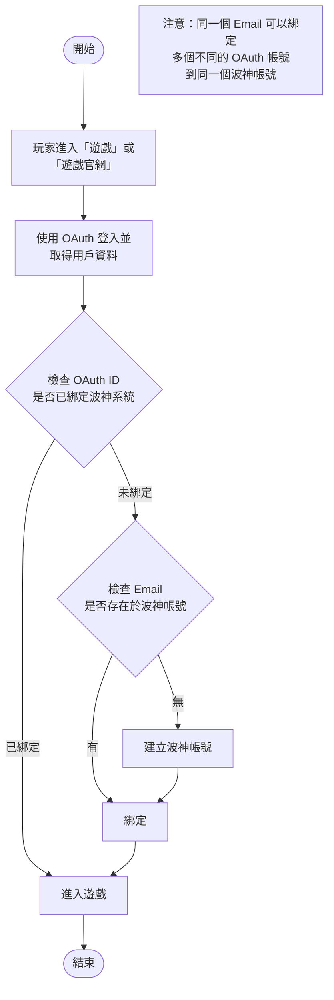

```mermaid
flowchart TD
    Start(["開始"]) --> EnterGame["玩家進入「遊戲」或<br>「遊戲官網」"]
    EnterGame --> OAuthLogin["使用 OAuth 登入並<br>取得用戶資料"]
    CheckUUID{"檢查 OAuth ID <br>是否已綁定波神系統"} -- 未綁定 --> CheckEmail{"檢查 Email <br>是否存在於波神帳號"}
    CheckEmail -- 有 --> BindOAuth["綁定"]
    CheckEmail -- 無 --> CreateAccount["建立波神帳號"]
    CreateAccount --> BindOAuth
    EnterGameSuccess1["進入遊戲"] --> End(["結束"])
    CheckUUID -- 已綁定 --> EnterGameSuccess1
    BindOAuth --> EnterGameSuccess1
    OAuthLogin --> CheckUUID
    note["注意：同一個 Email 可以綁定<br>多個不同的 OAuth 帳號<br>到同一個波神帳號"]
```